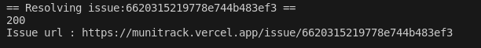
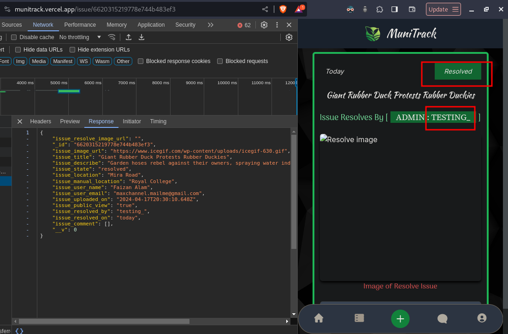

# Security Testing Report for MuniTrack

- Analyzing application security practices used in MuniTrack

## Application Information

### Version

- [78c62e1](https://github.com/faizan619/MuniTrack/tree/78c62e1d764c70d7b8aec06c4311721e96a5b2b8)

### Technologies

- Node.js
- Next.js
- Firebase
- MongoDB
- React.js

### Deployed URL

- [munitrack.vercel.app](https://munitrack.vercel.app)

### Developer

- [faizan619](https://github.com/faizan619)

### Security Tester

- [gh0stfrk](https://github.com/gh0stfrk)

## Testing Approach

#### White Box Analysis

- Codebase exploration resulted with the following findings

  1. [Next.js](https://nextjs.org/) application with firebase for authentication from the frontend
  2. Uses [useContext](https://react.dev/reference/react/useContext) to maintain user data came from firebase by authentication.
  3. [mongoose](https://mongoosejs.com/) is used to create and manage user data with [MongoDB](https://www.mongodb.com/)

- Security Issues

  1. Lack of Authorization on REST API routes, everything inside the `\backend` folder is accessible without any authorization, a simple http request can modify update or delete data.
 here's a link to [vulnerable code](https://github.com/faizan619/MuniTrack/blob/78c62e1d764c70d7b8aec06c4311721e96a5b2b8/src/app/backend/issue/route.js#L23-L59)
 There is no authorization check on the incoming request anyone can use the endpoint to create/modify data

    2. Every endpoint is insecure and could be abused by any user to create issues in name of other users.

## Proof Of Concept
- Using `requests` there is a script [munitrack.py](./munitrack.py) that demonstrates the issues
- Install requests library from pip
```
pip install requests
```
- Generate a few issues manually or with the script 
- Test resolving a issues by providing an Isssue Id to the script 
```
python3 munitrack.py
```

## Screenshots 



## Security Rating
*4/10*

## Suggestions
- Implement basic authorization techniques to secure REST API endpoints 
- Use the token accquired from firebase for authorization in the backend.
- Remodel the database 
